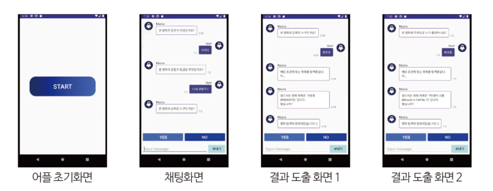
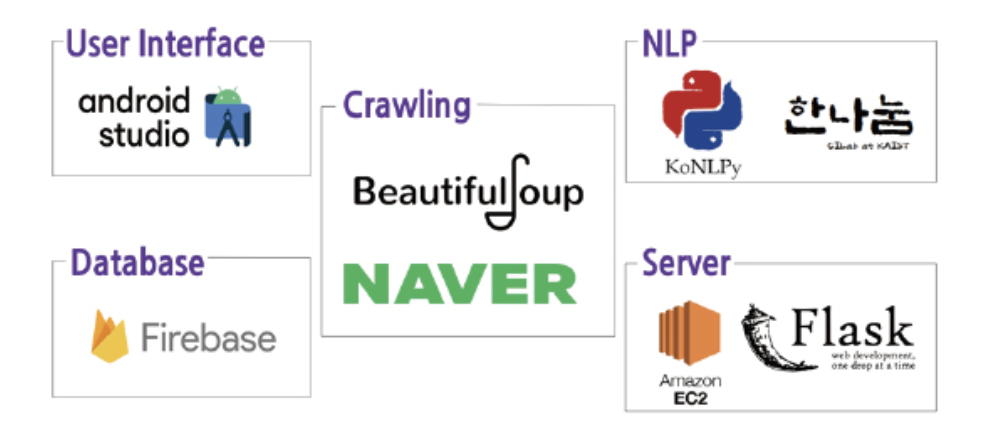

# Mudra-Chatbot
Mudra:: Chatbot that-finds-movies-through-keywords
- It is a chatbot application that finds movie titles that you don’t remember.

 

---
 

### 대학교 졸업 작품
- 팀원 (김혜빈, 허가회, 최효원, 이연희)

- 챗봇의 질문에 따른 사용자의 답변을 키워드로 추출해 직접 구축한 json 데이터 안에서 해당 영화 제목을 탐색해 반환하는 Application
    - '네이버 영화'를 크롤링 해 한국영화.json을 만들고 firebase에 업로드

 

- 작품 시연

 

- 시스템 아키텍쳐

> 현재 올라와있는 코드는 최종본이 아닙니다.
